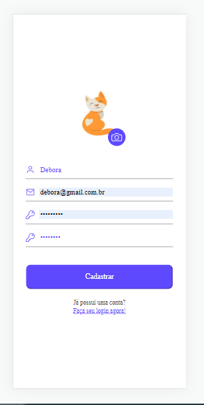
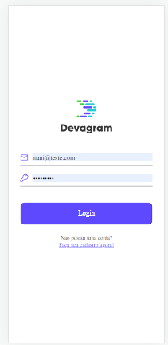
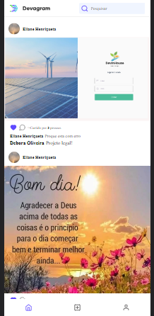
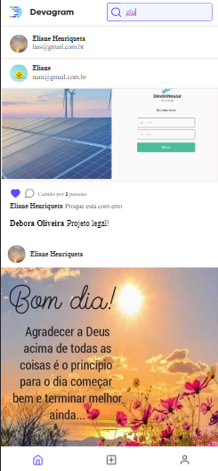

# Devagram Vue-Js

Este projeto foi desenvolvido durante o treinamento da Devaria em 2023, com base na funcionalidade principal do Instagram. O objetivo do projeto foi criar um clone simplificado do Instagram, implementando recursos fundamentais do aplicativo.

#
## Tecnologias Utilizadas

* Front-end: Vue.js
* Bibliotecas: Axios, Pinia, Vue3-Loading, Sass

#
## Funcionalidades Implementadas

* Cadastro de usuários
* Login de usuários
* Postagem de fotos
* Feed de publicaçoes
* Comentários e curtidas em publicações
* Pesquisa de usuários

#
## Configuração do Ambiente

1. Certifique-se de ter o Node.js e o Vue CLI instalados em seu ambiente de desenvolvimento
1. Clonar o repositório `git clone <git@github.com:Elianehenri/devagram-vue-js.git>`
1. Fazer uma copia do arquivo `.env.example` e renomear o novo arquivo de `.env.local`
1. Configurar as variáveis de ambiente no arquivo `.env.local`
1. Instale as dependencias do projeto `npm install`
1. Execute o comando `npm run dev` para executar a aplicação
1. Acesse o projeto em seu navegador através do seguinte endereço: http://localhost:8080 (ou a porta que você especificar).

#
## Resultado Final

  
  
  
  

#
## Agradecimentos

Agradeço à equipe da Devaria pelo treinamento e suporte durante o desenvolvimento deste projeto. 

#
### Autor
* **Eliane Henriqueta**
